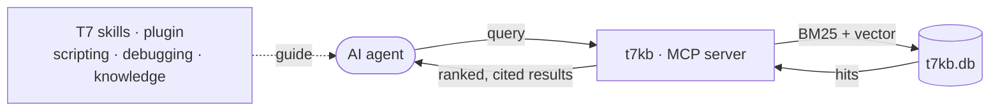

# T7 Companion

   

The go-to companion for working with AI agents on **Black Ops 3 modding** — it gives your agent a local, offline knowledge base of the BO3 modding community. `t7kb` is the engine: a single pure-Go binary serving hybrid retrieval (keyword + semantic) over a bundled SQLite index (`t7kb.db`), driven over MCP, with a small CLI for direct use. Everything runs locally and offline.

> [!NOTE]
> Works with any MCP-capable agent — Claude Code, Codex, OpenCode, Copilot, Cursor.



> [!NOTE]
> The **skills** ship as a **Claude Code plugin** (auto-loaded there). On other agents they aren't delivered automatically — paste the same guidance into your project: see [`templates/AGENTS.md`](templates/AGENTS.md) and [docs/clients.md](docs/clients.md). The `t7kb` / MCP loop below it is universal.

## 📥 Install & connect

**Claude Code** — install the plugin; it downloads `t7kb` + the database and registers the MCP server for you, no manual install step needed:

```
/plugin marketplace add t7-reapy/t7_companion
/plugin install t7kb@t7-reapy
/t7kb:setup
```

**Any other MCP client** (Codex, OpenCode, Cursor, Copilot) — point your agent at this README and it can run the install itself (same `curl`/`irm` one-liner as above, just unattended), or run it yourself:

```bash
curl -fsSL https://raw.githubusercontent.com/t7-reapy/t7_companion/main/install/install.sh | bash
```
```powershell
irm https://raw.githubusercontent.com/t7-reapy/t7_companion/main/install/install.ps1 | iex
```

Then wire up `t7kb mcp` as a stdio server — see **[docs/clients.md](docs/clients.md)** for copy-paste config per client and the workspace `AGENTS.md` drop-in.

> [!NOTE]
> Both installers are idempotent (skip the ~0.9 GB DB download if already installed; `-Force`/`--force` to reinstall) and download the binary + embedding model + database into one folder (`~/.t7kb`, or `%LOCALAPPDATA%\t7kb`), unpacking the ~3.5 GB DB on first run. Prefer to do it by hand? Download the release archive + `t7kb.db.zip` and extract them into one folder instead.

## ⌨️ CLI

```
t7kb
t7kb search <query>...
t7kb get <doc_id>
t7kb mcp
```

> [!NOTE]
> Bare `t7kb` opens an **interactive browse** (type a query → pick a numbered hit → read its body). `search` is hybrid keyword + semantic — `--bm25` keyword-only, `-n N` result count, `--scores` to show RRF + reliability. `get <doc_id>` prints a full document. `mcp` runs the stdio server. `--db PATH` overrides the database (default: `$T7KB_DB`, then beside the binary, then `./t7kb.db`).

## 📄 License

> [!IMPORTANT]
> Code is **MIT** (see [`LICENSE`](LICENSE)). `t7kb.db` bundles knowledge from the BO3 modding community; every row carries its `source` + `url` for attribution — see [`NOTICE.md`](NOTICE.md).
